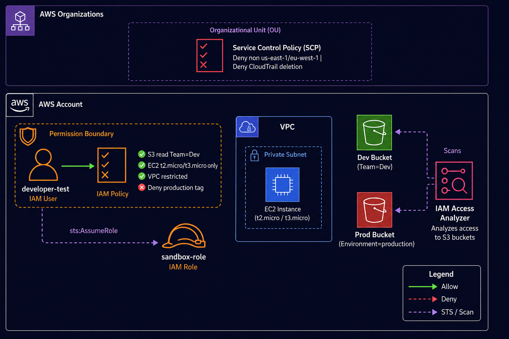

# IAM Policy Testing & Validation

A production-grade implementation of layered AWS IAM security controls using Terraform. Demonstrates tag-based access control, instance type restrictions, VPC-scoped permissions, permission boundaries, Service Control Policies, and automated policy validation.

---

## Architecture

<!-- GROK INSTRUCTIONS — replace this comment block with the generated image -->
<!-- 
  PROMPT FOR GROK:
  Create an AWS architecture diagram using official AWS icons with a dark background (#1a1a2e).
  Show the following components and relationships:

  1. A box labeled "AWS Organizations OU" at the top containing a "Service Control Policy" icon
     with labels: "Deny non us-east-1/eu-west-1 | Deny CloudTrail deletion | Deny LeaveOrg"

  2. Below it, a large box labeled "AWS Account 866934333672" containing:
     - An outer dashed box labeled "Permission Boundary (ceiling)" in orange
     - Inside it: an IAM User icon labeled "developer-test"
     - Below the user: an IAM Policy icon labeled "Custom Developer Policy"
       with 4 bullet annotations:
       ✅ S3 read — buckets tagged Team=Dev only
       ✅ EC2 launch — t2.micro / t3.micro only
       ✅ EC2 restricted to Lab VPC
       ❌ Deny tag Environment=production

  3. To the right of the user: an IAM Role icon labeled "sandbox-role"
     with a dashed arrow from the user labeled "sts:AssumeRole"

  4. A VPC box labeled "Lab VPC 10.99.0.0/16" containing a subnet and EC2 icon

  5. Two S3 bucket icons:
     - One labeled "Dev Bucket" with a green checkmark (Team=Dev tag)
     - One labeled "Prod Bucket" with a red X (Environment=production tag)

  6. An IAM Access Analyzer icon scanning both S3 buckets

  7. Arrows connecting: Policy → S3 Dev (allow), Policy → S3 Prod (deny), Policy → VPC (allow)

  Use AWS color scheme: orange for IAM, green for S3, blue for EC2/VPC, purple for STS.
  Add a legend at the bottom showing Allow (green arrow) vs Deny (red arrow).
-->



---

## Overview

This project implements a **defense-in-depth IAM model** for a developer persona in AWS. Rather than relying on a single policy, security is enforced through multiple independent layers — so that a misconfiguration in any one layer does not expose the entire account.

```
Request → SCP check → Permission Boundary check → Identity Policy check → Allow/Deny
```

Each layer is independent. An explicit `Deny` at any layer cannot be overridden.

---

## Security Layers Implemented

| Layer | Mechanism | Scope |
|-------|-----------|-------|
| SCP | Organizations policy | Entire OU — caps the whole account |
| Permission Boundary | IAM boundary policy | Single user — caps maximum permissions |
| Identity Policy | Custom managed policy | Single user — grants scoped permissions |
| Session Policy | Inline at AssumeRole | Single session — further restricts at runtime |

---

## What Gets Deployed

| Resource | Name | Purpose |
|----------|------|---------|
| IAM User | `developer-test` | Subject of all policy tests |
| IAM Policy | `jhon-developer-policy` | Tag-based S3 + instance-type EC2 control |
| IAM Policy | `jhon-developer-boundary` | Permission ceiling — blocks IAM, billing, CloudTrail |
| IAM Role | `jhon-developer-sandbox-role` | Target for assume-role + session policy tests |
| S3 Bucket | `jhon-lab-dev-team-*` | Tagged `Team=Dev` — accessible to developer |
| S3 Bucket | `jhon-lab-production-*` | Tagged `Environment=production` — explicitly denied |
| VPC | `jhon-iam-lab-vpc` | EC2 launch restriction target (10.99.0.0/16) |
| Access Analyzer | `jhon-lab-access-analyzer` | Monitors for unintended public resource exposure |
| SCP JSON | `policies/scp_policy.json` | Region lock + CloudTrail protection policy |

---

## Policy Design

### Developer Policy — Four Control Layers

**Layer 1: S3 read-only on Dev-tagged buckets**
```json
{
  "Effect": "Allow",
  "Action": ["s3:GetObject", "s3:ListBucket"],
  "Resource": ["arn:aws:s3:::*", "arn:aws:s3:::*/*"],
  "Condition": {
    "StringEquals": { "aws:ResourceTag/Team": "Dev" }
  }
}
```

**Layer 2: EC2 launch — small instances only**
```json
{
  "Effect": "Allow",
  "Action": "ec2:RunInstances",
  "Resource": "arn:aws:ec2:us-east-1:ACCOUNT_ID:instance/*",
  "Condition": {
    "StringEquals": { "ec2:InstanceType": ["t2.micro", "t3.micro"] }
  }
}
```

**Layer 3: EC2 VPC restriction**
```json
{
  "Effect": "Allow",
  "Action": "ec2:RunInstances",
  "Resource": ["arn:aws:ec2:...:subnet/*", "...security-group/*"],
  "Condition": {
    "ArnLike": { "ec2:Vpc": "arn:aws:ec2:...:vpc/VPC_ID" }
  }
}
```

**Layer 4: Explicit Deny — production resources**
```json
{
  "Effect": "Deny",
  "Action": ["s3:*", "ec2:*", "rds:*", "lambda:*", "dynamodb:*"],
  "Resource": "*",
  "Condition": {
    "StringEquals": { "aws:ResourceTag/Environment": "production" }
  }
}
```

### Why Explicit Deny for Production?

An implicit deny (no Allow) can be bypassed by attaching another policy later. An **explicit Deny can never be overridden** — not by another policy, not by a role, not by an admin attaching a broader managed policy. It is the strongest control available.

### SCP — Region Lock + CloudTrail Protection

The SCP enforces account-wide controls that apply to every identity including root:

- **Deny all regions except `us-east-1` and `eu-west-1`** — using `NotAction` to exclude global services (IAM, STS, Route53, CloudFront)
- **Deny CloudTrail modification** — `DeleteTrail`, `StopLogging`, `UpdateTrail`
- **Deny leaving the organization** — prevents an attacker from escaping SCP controls
- **Deny root user actions** — forces all operations through IAM identities

---

## Prerequisites

- Terraform >= 1.6.0
- AWS CLI configured with admin credentials
- Python 3.10+ with boto3 (`pip3 install boto3`)
- GitHub CLI (`gh`) for repo operations

---

## Deployment

```bash
# Clone the repository
git clone https://github.com/JohnMaldonado/iam-policy-testing.git
cd iam-policy-testing

# Initialize and deploy
cd terraform
terraform init
terraform apply -auto-approve

# Capture outputs for test scripts
export DEV_BUCKET=$(terraform output -raw dev_bucket_name)
export PROD_BUCKET=$(terraform output -raw production_bucket_name)
export LAB_VPC_ID=$(terraform output -raw lab_vpc_id)
export ANALYZER_ID=$(terraform output -raw access_analyzer_id)
export SANDBOX_ROLE_ARN=$(terraform output -raw sandbox_role_arn)
export ACCOUNT_ID=866934333672
```

---

## Running the Test Suite

### Test 1 — IAM Policy Simulator (8 test cases)

Uses the AWS Policy Simulator API to validate allow/deny decisions without executing real actions.

```bash
python3 scripts/01_test_policy_simulator.py
```

Expected output:
```
✅ PASS  TC-01: List all S3 buckets           → allowed
✅ PASS  TC-02: Deny S3 DeleteObject          → explicitDeny
✅ PASS  TC-03: Allow RunInstances t2.micro   → allowed
✅ PASS  TC-04: Deny RunInstances t2.large    → implicitDeny
✅ PASS  TC-05: Allow GetObject from Dev bucket → allowed
✅ PASS  TC-06: Deny access to production bucket → explicitDeny
✅ PASS  TC-07: Deny t2.large regardless of VPC → implicitDeny
✅ PASS  TC-08: Deny s3:DeleteBucket          → explicitDeny
Results: 8/8 passed
```

### Test 2 — Access Analyzer Findings

Validates that no lab resources are publicly exposed.

```bash
python3 scripts/02_test_access_analyzer.py
```

Expected output:
```
✅ Dev bucket     — no public access findings
✅ Production bucket — no public access findings
Result: ALL CLEAR
```

### Test 3 — Assume Role + Session Policy

Demonstrates that session policies further restrict (never expand) assumed role permissions.

```bash
export AWS_ACCESS_KEY_ID=$(terraform output -raw developer_access_key_id)
export AWS_SECRET_ACCESS_KEY=$(terraform output -raw developer_secret_access_key)

python3 scripts/03_test_assume_role.py
```

Expected output:
```
✅ PASS  AssumeRole succeeds (no session policy)
✅ PASS  EC2 Describe with full role
✅ PASS  AssumeRole with session policy succeeds
✅ PASS  EC2 Describe with restricted session (in session policy)
✅ PASS  S3 ListBuckets blocked (not in session policy)
```

---

## Session Policy — Key Concept

```
Effective permissions = (Role policy) ∩ (Session policy)
```

A session policy **cannot grant more than the role has**. It can only further restrict what the assumed session can do. This is the principle of least privilege applied at runtime — ideal for CI/CD pipelines that assume a broad role but should only access specific resources per job.

---

## IAM Decision Flow

```
API Request
    │
    ▼
┌─────────────────────────────────────────┐
│ 1. Explicit DENY anywhere?              │
│    (SCP / Boundary / Identity Policy)   │
│    YES → DENY  (cannot be overridden)   │
│    NO  → continue                       │
└─────────────────────────────────────────┘
    │
    ▼
┌─────────────────────────────────────────┐
│ 2. SCP allows this action in region?    │
│    NO  → DENY                           │
│    YES → continue                       │
└─────────────────────────────────────────┘
    │
    ▼
┌─────────────────────────────────────────┐
│ 3. Permission Boundary allows?          │
│    NO  → DENY                           │
│    YES → continue                       │
└─────────────────────────────────────────┘
    │
    ▼
┌─────────────────────────────────────────┐
│ 4. Identity Policy allows?              │
│    NO  → IMPLICIT DENY                  │
│    YES → ALLOW                          │
└─────────────────────────────────────────┘
```

---

## Cleanup

```bash
# Restore admin credentials first
unset AWS_ACCESS_KEY_ID
unset AWS_SECRET_ACCESS_KEY

cd terraform
terraform destroy -auto-approve
```

---

## Repository Structure

```
iam-policy-testing/
├── terraform/
│   ├── providers.tf          # AWS, local, null, random providers
│   ├── variables.tf          # Input variables
│   ├── terraform.tfvars      # Variable values
│   ├── vpc.tf                # Lab VPC, subnet, IGW, S3 buckets
│   ├── iam_user.tf           # developer-test user + access keys
│   ├── iam_policies.tf       # Custom developer policy
│   ├── iam_boundary.tf       # Permission boundary + sandbox role
│   ├── scp.tf                # SCP policy document
│   ├── access_analyzer.tf    # IAM Access Analyzer
│   └── outputs.tf            # ARNs, bucket names, VPC ID
├── policies/
│   └── scp_policy.json       # Generated SCP JSON for Organizations
├── scripts/
│   ├── 01_test_policy_simulator.py
│   ├── 02_test_access_analyzer.py
│   └── 03_test_assume_role.py
└── docs/
    └── 01-architecture.md
```

---

## Key AWS Services

| Service | Role in this project |
|---------|---------------------|
| IAM | Users, policies, roles, permission boundaries |
| STS | AssumeRole + session policy enforcement |
| S3 | Tag-based access control target |
| EC2 | Instance type + VPC restriction target |
| IAM Access Analyzer | Public resource exposure detection |
| AWS Organizations | SCP attachment (policy provided for manual application) |

---

*Built as part of a structured AWS DevOps engineering program. Deployed and validated in a live AWS environment with automated test coverage.*
