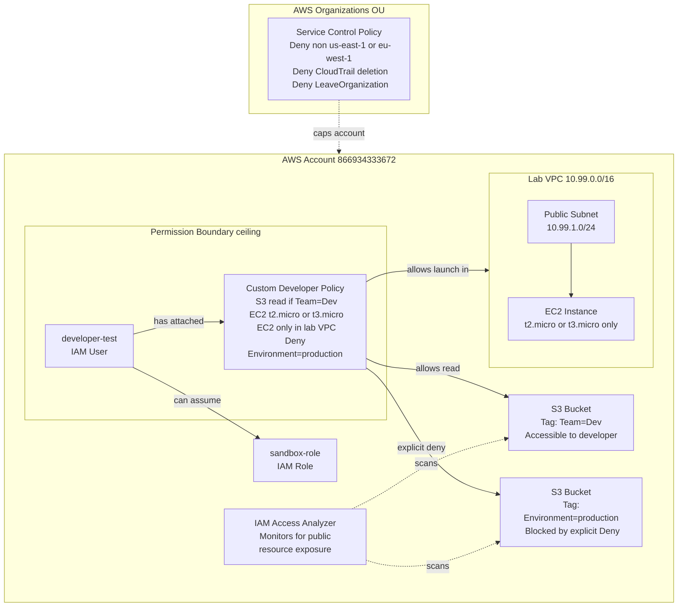

# IAM Policy Testing & Validation — Architecture

## Overview

This project implements a layered IAM security model for a developer persona within AWS, demonstrating tag-based access control, instance type restrictions, VPC-scoped permissions, permission boundaries, SCPs, and IAM Access Analyzer.

---

## Architecture Diagram



---

## IAM Decision Flow

```
Request arrives
      │
      ▼
┌─────────────────────────────────────────────────┐
│  1. Is there an explicit DENY anywhere?          │
│     (SCP, Permission Boundary, Identity Policy)  │
│     YES → DENY (stops here, no appeal)           │
│     NO  → continue                               │
└─────────────────────────────────────────────────┘
      │
      ▼
┌─────────────────────────────────────────────────┐
│  2. Does the SCP ALLOW this action in this       │
│     region?                                      │
│     NO  → DENY                                   │
│     YES → continue                               │
└─────────────────────────────────────────────────┘
      │
      ▼
┌─────────────────────────────────────────────────┐
│  3. Does the Permission Boundary ALLOW this?     │
│     NO  → DENY                                   │
│     YES → continue                               │
└─────────────────────────────────────────────────┘
      │
      ▼
┌─────────────────────────────────────────────────┐
│  4. Does the Identity Policy ALLOW this?         │
│     NO  → IMPLICIT DENY                          │
│     YES → ALLOW                                  │
└─────────────────────────────────────────────────┘
```

---

## Policy Layers Explained

| Layer | Type | Scope | Can Override? |
|-------|------|-------|---------------|
| SCP | Organizations policy | Entire OU/account | No — root cannot bypass |
| Permission Boundary | IAM | Single user/role | Only by removing it |
| Identity Policy | IAM | Single user/role | Yes, by attaching more policies |
| Session Policy | STS inline | Single session | Never adds — only restricts |

---

## Test Cases

| ID | Action | Resource | Condition | Expected |
|----|--------|----------|-----------|----------|
| TC-01 | s3:ListAllMyBuckets | * | none | `allowed` |
| TC-02 | s3:DeleteObject | Dev bucket | Team=Dev | `explicitDeny` |
| TC-03 | ec2:RunInstances | instance/* | t2.micro | `allowed` |
| TC-04 | ec2:RunInstances | instance/* | t2.large | `implicitDeny` |
| TC-05 | s3:GetObject | Dev bucket | Team=Dev | `allowed` |
| TC-06 | s3:GetObject | Prod bucket | Environment=production | `explicitDeny` |
| TC-07 | ec2:RunInstances | instance/* | t2.large + VPC | `implicitDeny` |
| TC-08 | s3:DeleteBucket | Dev bucket | Team=Dev | `explicitDeny` |
